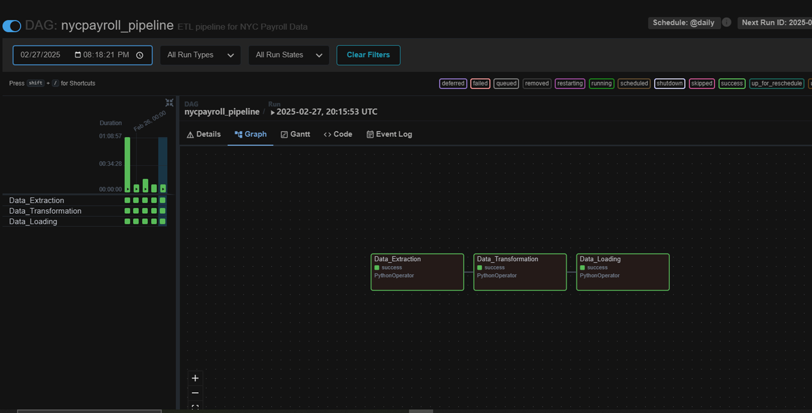

# NYC Payroll Data Integration Project

## Introduction
#### The City of New York is embarking on a project to integrate payroll data across all its agencies in order to achieve below objectives: and would like to develop a Data Analytics platform to accomplish two primary objectives:

#### 1. Analyze financial resource allocation overtime.
#### 2. Improve transparency and public accessibility of the City Budget
#### 3. Develop an efficient Data Analytics platform

## PROJECT OBJECTIVES
#### 1. Design a Data Warehouse for NYC 
#### 2. Develop a scalable and automated ETL Pipeline to load the payroll data into the data warehouse
#### 3. Ensure quality and consistency of data in your pipeline
#### 4. Create a public user with limited privileges to enable public access to the NYC Data warehouse

## Data Warehouse Design for NYC 

## ETL DATA ARCHITECTURE

## ETL Pipeline Overview
#### 1. Extraction: Retrieve payroll and Master data from CSV files stored in a remote directory.
#### 2. Transformation: Clean, standardize, and merge datasets to ensure consistency and accuracy.
#### 3. Loading: Load the processed data into a PostgreSQL data warehouse for storage and analysis.
#### 4. Orchestration: Use Apache Airflow to efficiently automate and monitor the pipeline execution.

## TECHNOLOGY STACKS USED
#### 1. Python: Was used for the ETL pipeline scripting due to its simplicity and vast ecosystem of libraries.
#### 2. PySpark: Was essential for the data manipulation and transformation.
#### 3. PostgreSQL: Was used for data storage relational database that ensures efficient storage and querying of structured data.
#### 4. Psycopg2 & Postgresql-42.7.4.jar: Used to interact with database allowing direct execution of SQL commands within Python scripts.
#### 5. Apache Airflow (Orchestration): Was used for the automation, scheduling, and monitoring of the ETL pipeline.
#### 6. GitHub: Version control and documentation.

## Optimization Recommendations For NYC
#### 1. Use cloud-based data warehouses (e.g., Snowflake, BigQuery, or Amazon Redshift) for scalability.
#### 2. Optimize SQL queries by implementing indexing and partitioning strategies.
#### 3. Schedule data pipeline executions during off-peak hours to reduce system load.

## Conclusion
#### In this project I was able to design and implement a payroll data pipeline to efficiently process and analyze payroll records of NYC. Using PySpark, raw payroll data from CSV files was cleaned, transformed, and prepared for loading. The transformed data was then stored in a PostgreSQL data warehouse for structured querying and reporting. Apache Airflow was utilized to orchestrate the entire pipeline, automating data extraction, transformation, and loading (ETL) processes.

## Apache Airflow Orchestration

## Data Warehouse Schema

## PostgreSQL Data Warehouse

